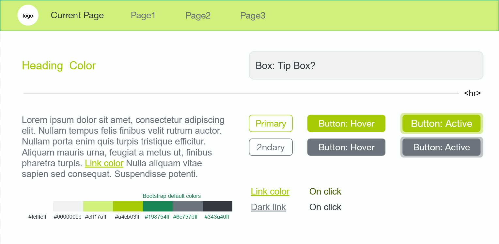

# Intro — Read This

This file provides classes that have been included in styling and example usages of them.

This only covers custom-added styling, and only includes Bootstrap components if they have been altered.  If elements haven't been included here, assume default usage either with Bootstrap or unaltered HTML is sufficient.

This document contains information on the following:

- Test page
- Partials
- Using local assets
- Copy-able Hex Values
- Containing Page Content
- Colored boxes
- Buttons and Links
- Images (for use of icons)
- Tables

It isn't necessary to read the entire thing to parse a section.

# Test page

In this directory, `test.html` is a basic HTML file that demonstrates several elements with the current style library applied to them and allows for testing elements and styling.  It is not necessary to run the server to view this page.

# Partials

In the partials folder, `header.ejs` and `footer.ejs` contain meta data and tags for pages and must be included.

To use on a page:

    <%- include ('../partials/header') %>
        ...
    <%- include ('../partials/footer') %>

The navbar also is stored within its own partial, in case you don't want to use it on a page, and also for organization purposes.

    <%- include ('../partials/navbar') %>

# Using Local Assets

To use local assets (which should be stored in the `resources` folder), do not specify file paths from whatever file you are trying to pull the asset from.  Specify respective to the resource folder.

For example, to access file `project_code_and_components/resources/img/logo_icon.png`:

    img/logo_icon.png

# Styles

Code that adds certain styling to various HTML elements.  IMPORTANT: when using these in addition to default Bootstrap style classes, both the Bootstrap and these classes must be given to the element.

## Copy-able Hex Values

Note: Hex codes do not here generally include alpha (transparency) channels code and by default are at 100%.

- #fcfffe
- ##0000000d
- #cff17a
- #a4cb03
- #198754
- #6c757d
- #343a40

## Page Content

Class "content:" creates a container that will push all content that it contains away from surrounding content (EX, the viewport when containing all body content).

    <main class = "content"> 
        ...
    </main>

Note: navbar included to show example of how the container interacts with other elements.

## Colored Boxes

Class "box": creates a colored box.

    

        ...
    

The image displays a link and normal text content in the box, but it can contain anything.

## Buttons and Links

"Primary" button is meant to be used for most buttons.  "Secondary" button is meant for usage when two options with a hierarchy are given (EX, a prompt with "confirm" or "cancel" options).

    <button type="button" class="btn btn-outline-primary">Primary</button>

    <button type="button" class="btn btn-outline-secondary">Secondary</button>

By default, buttons will appear side-by-side to content if possible (such as each other or text), so additional containers/styling is necessary if forcing them to a new line.

Class "dark-link" turns a link into a darker color, more suitable for darker backgrounds.

    <a class = ".dark-link">...</a>

## Icons

Class "icon" puts an image into a circular frame.
    
    

The class does not alter image size, so the size of the full image will by default be whatever the size of source image is, unless affected by additional styling.

Currently, the class does not force images that aren't square to be in circular (square) frames; images must be in square aspect ratios to appear as a circle (will be elliptical otherwise).

## Tables

Class "td-vertical-center" aligns text in a table cell vertically to center.

Class "td-horizontal-center" aligns text in a table cell horizontally to center.

    <td class = "td-vertical-center"></td>

    <td class = "td-horizontal-center"></td>